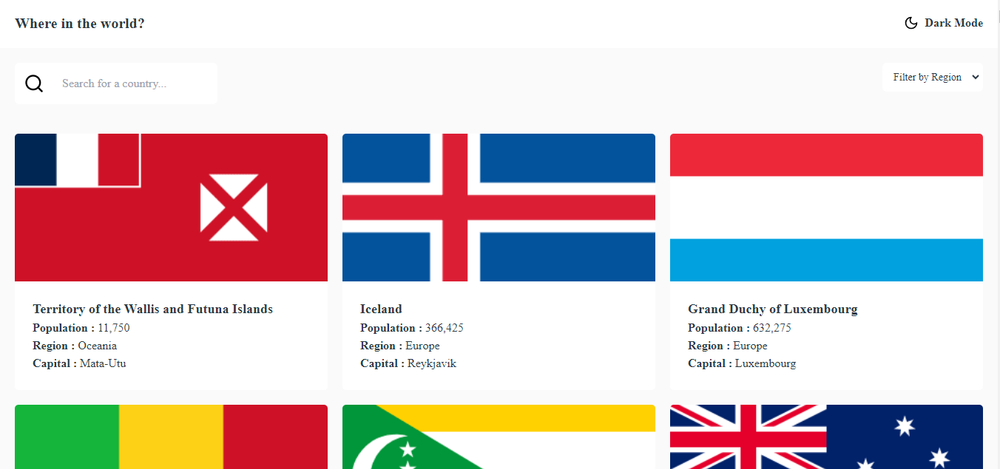

# Frontend Mentor - REST Countries API with color theme switcher solution

This is a solution to the [REST Countries API with color theme switcher challenge on Frontend Mentor](https://www.frontendmentor.io/challenges/rest-countries-api-with-color-theme-switcher-5cacc469fec04111f7b848ca). Frontend Mentor challenges help you improve your coding skills by building realistic projects.

## Table of contents

- [Overview](#overview)
  - [The challenge](#the-challenge)
  - [Screenshot](#screenshot)
  - [Links](#links)
- [My process](#my-process)
  - [Built with](#built-with)
- [Author](#author)

## Overview

### The challenge

Users should be able to:

- See all countries from the API on the homepage
- Search for a country using an `input` field
- Filter countries by region
- Click on a country to see more detailed information on a separate page
- Click through to the border countries on the detail page
- Toggle the color scheme between light and dark mode _(optional)_

### Screenshot

### Links

<!-- - Solution URL: [Add solution URL here](https://your-solution-url.com) -->

- Live Site URL: [Add live site URL here](https://rest-country-api-havreloic.netlify.app/)

## My process

- Project setup: Adding dependencies and files setup
- Add ErrorPage for HTTP Errors and Routing
- File and folder structure

### Built with

- Tailwind
- Typescript
- Context API as state management
- [React](https://reactjs.org/) - JS library
- [testing-library/react](https://testing-library.com/docs/react-testing-library/intro/) - for testing React components

## Author

- Website - [Havre Loic](https://havre.netlify.app/)
- Frontend Mentor - [@HavreLoic](https://www.frontendmentor.io/profile/HavreLoic)
